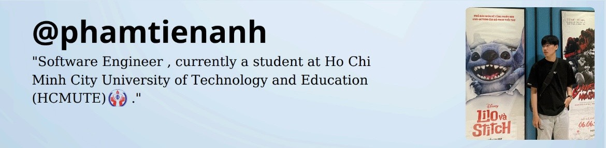

<!-- Banner / Cover -->

<!-- Intro Section -->

  

<table>
  <tr>
    <!-- Left Column: Information -->
    <td width="55%" style="vertical-align: top;">
      <h2>👋 About Me</h2>
      
🚀 <strong>Backend Developer</strong> passionate about building scalable systems and DevOps automation.

      
💼 Had work experience at <strong><a href="https://geekup.vn/">GEEK Up</a></strong> and <strong><a href="https://bit.com.vn/">BIT Group</a></strong>.

      
🎓 Software Technology student at <strong>HCMUTE</strong> (GPA: 3.62/4.0).

      
🏆 2-time Recipient of University Academic Scholarship.

      
📜 <strong>Certifications:</strong> AWS Academy Graduate, TOEIC 680.

      
⚡ Fun fact: <em>I love optimizing workflows and automating everything!</em>

    </td>
    <!-- Right Column: GIF -->
    <td width="45%" align="center">
      
    </td>
  </tr>
</table>

---

## 🛠 Tech Stack

**Languages:**  
 &nbsp; 
 &nbsp; 
 &nbsp; 
 &nbsp; 

**Frameworks & Libraries:**  
 &nbsp; 
 &nbsp; 
 &nbsp; 
 &nbsp; 
 &nbsp; 
 &nbsp; 

**Databases:**  
 &nbsp; 
 &nbsp; 
 &nbsp; 
 &nbsp; 

**DevOps & Infrastructure:**  
 &nbsp; 
 &nbsp; 
 &nbsp; 
 &nbsp; 
 &nbsp; 
 &nbsp; 
 &nbsp; 
 &nbsp; 

**Other Technologies:**  
 &nbsp; 
 &nbsp; 

---

## 📌 Featured Projects

### 🚀 [LEANOVA – Smart Learning System](https://github.com/t9tieanh/Learning-Platform)
**Fullstack Developer** | *Sep 2025 - Present*
- **Short Description:** A comprehensive full-stack e-learning platform designed with a microservices architecture to empower instructors and provide learners with interactive, real-time communities.
- **Tech Stack:** Spring Boot, NestJS, ReactJS, gRPC, RabbitMQ, MySQL, MongoDB, Redis, Docker, AWS (S3, CloudFront).
- **Technical Highlights:**
  - Architected with **Microservices** & Spring Cloud Gateway for routing and JWT validation.
  - Implemented **Saga Pattern** to manage distributed transactions across services.
  - Optimized communication using **gRPC** (sync) and **RabbitMQ** (async).
  - Built real-time features with **Socket.IO** and AI history storage in MongoDB.
  - Deployed via **CI/CD GitHub Actions** to VPS using Docker.
- **GitHub:** [t9tieanh/Learning-Platform](https://github.com/t9tieanh/Learning-Platform)
- **Website:** [learnova.t9tieanh.io.vn](https://learnova.t9tieanh.io.vn/)

### 📍 [FreeClassRoom](https://github.com/t9tieanh/freeclassroom_)
**Fullstack Developer** | *June 2025 - July 2025*
- **Short Description:** An open learning platform for creating courses, joining classes, and sharing knowledge through posts.
- **Tech Stack:** Node.js (TypeScript), ExpressJS, ReactJS, JWT, OAuth2, MongoDB, Redis, RabbitMQ.
- **Technical Highlights:**
  - Integrated **OAuth2 (Google Sign-In)** and secured APIs with JWT.
  - Implemented asynchronous notification services using **RabbitMQ**.
  - Utilized **Redis** for caching and secure OTP code storage.
  - Developed real-time messaging using **Socket.IO**.
  - Managed image storage with **Cloudinary**.
- **GitHub:** [t9tieanh/freeclassroom_](https://github.com/t9tieanh/freeclassroom_)

### 🏨 [HOTELAS – Booking System](https://github.com/t9tieanh/DAS_HotelManagement)
**Fullstack Developer** | *March 2025 - May 2025*
- **Short Description:** A hotel booking system featuring room search, details, and reservations with integrated online payment.
- **Tech Stack:** Spring Boot, ReactJS, JWT, OAuth2, MySQL, Redis, VNPay, Docker.
- **Technical Highlights:**
  - Built a responsive UI using **ReactJS** and **Bootstrap**.
  - Integrated **VNPay** for secure online payment processing.
  - Implemented **Google Login (OAuth2)** and JWT-based authentication.
  - Containerized the entire system with **Docker** for easy scalability and deployment.
- **GitHub:** [t9tieanh/DAS_HotelManagement](https://github.com/t9tieanh/DAS_HotelManagement)

---

## 📫 Connect with Me

---

