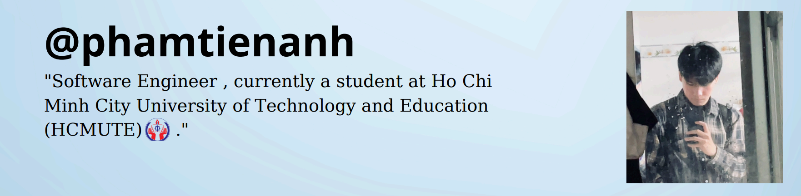

<h1 align="left">Hi 👋, I'm PhamTienAnh</h1>

  

<table  style="width: 100%; table-layout: fixed;" >
  <tr>
    <td style="width: 50%; padding: 10px; box-sizing: border-box;">

  - 🔭 I’m currently working on [**FreeClassRoom**](https://github.com/t9tieanh/_freeclassroom)  
  - 🌱 I’m currently learning **Spring Boot**, **React JS**, and **Next JS**  
  - ✅ Completed projects:
    - [**HotelAS - Hotel Booking System**](https://github.com/t9tieanh/DAS_HotelManagement)  
    - [**Web Ecommerce**](https://github.com/Tcrow06/WebEcommerce_2024-2025)  
  - 👨‍💻 All of my projects are available at [github.com/t9tieanh](https://github.com/t9tieanh)  
  - ✍ I write articles on [my blog](https://t9tieanh.github.io/tieanh19-infomation/)  
  - 💬 Ask me about **React**, **Spring Boot**  
  - 📫 Reach me via **phama9162@gmail.com**  
  - 📄 View my CV: [My CV on TopCV](https://www.topcv.vn/xem-cv/CAMEBVBdVA4HWAZWVwUNA1VWBFQEXFZSB1sEBA6dce)  
  - ⚡ Fun fact: *I’ve received two scholarships at HCMUTE!*  

    </td>
    <td style="width: 50%; padding: 10px; box-sizing: border-box;">
      
    </td>
  </tr>
</table>

<h3 align="left">Connect with me:</h3>

<h3 align="left">Languages and Tools:</h3>

             
